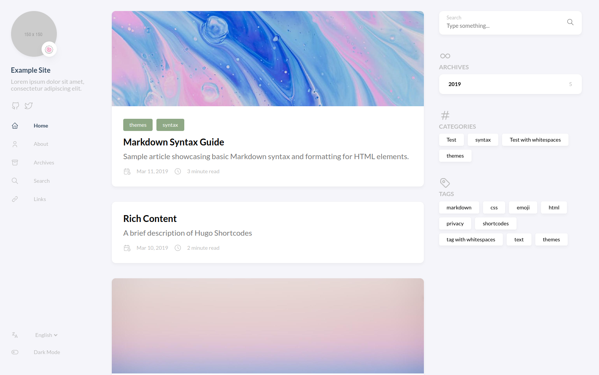

## はじめに

勢いでこのブログを作成したので、いろんな壁にぶち当たりながらなんとか作成した感じになっています。
作った当日にこのブログを書くことでなるべく、忘れないうちに備忘録として残しておけるようにしたいって感じですかね。
まぁあとはきっと他の誰かが見て参考にしてくれたら嬉しいなの気持ちもちょっとあったりしたり。

## 環境

* Arch Linux x86_64
* hugo v0.111.3+extended linux/amd64 BuildDate=unknown
* git version 2.40.1
* GitHub Pages

## Hugoのインストール

自分はArch Linuxの環境だったので、以下のコマンドでインストール。
```bash
$ pacman -S hugo
```

他のOSを使っている人は、難しいものでもないので[公式HP](https://gohugo.io/installation/)から確認してください。

インストールが終わったら今度は、`hugo new site <string>`で新たにディレクトリごとページを作成。

```bash
$ hugo new site test
Congratulations! Your new Hugo site is created in /home/amaototi/test.

Just a few more steps and you're ready to go:

1. Download a theme into the same-named folder.
   Choose a theme from https://themes.gohugo.io/ or
   create your own with the "hugo new theme <THEMENAME>" command.
2. Perhaps you want to add some content. You can add single files
   with "hugo new <SECTIONNAME>/<FILENAME>.<FORMAT>".
3. Start the built-in live server via "hugo server".

Visit https://gohugo.io/ for quickstart guide and full documentation.
```

## テーマの設定

Hugoはテーマを自由に決めることができるとてもカスタマイズ性の高いフレームワークなので、自分で好みのテーマを探すと良いです。
自分はStackというテーマに。テーマは[こちら](https://themes.gohugo.io/)からどうぞ。

テーマを決めたら`git init`からの`git submodule add https://github.com/CaiJimmy/hugo-theme-stack/ themes/hugo-theme-stack`でテーマをインストール。ここは各自選んだテーマのドキュメントを確認してください。

インストールができたら、`themes/hugo-themes-stack/examples`の中にある`config.yaml`と`content/`を先程作成したディレクトリ直下にコピー。その際、`config.toml`は削除します。

ここまで終わった状態で`hugo server -D`をして、`http://localhost:1313/`にアクセスすると、、、



といった感じで動きます。感動。
そしたら次はカスタマイズをしてきます。

と言ってもやることは、不必要なexampleを消すのと、config.yamlの編集を行うだけ。

### 変更点

* `languageCode`と`DefaultContentLnaguage`を`ja`に
* `publishDir: docs`をどっか適当に追記
* `parms`内部
  * `sidebar`の中身全般
    * `emoji`はアイコンの右下にちっちゃくつくやつ
  * `article`の中身ちょっと
    * `math`は数学の記法をつかえるようにするかどうか
    * `toc`は目次の表示非表示
    * `readingTime`は読了時間の表示
    * `license`はライセンスの表示
* `menu`内部
  * `social`の中身
    * `GitHub`と`Twitter`のリンクを追加

だいたいこの程度の変更。あとは、公式ドキュメントを読んだり、先人たちの知恵を借りたりという感じ。

## GitHub Pagesに登録

GitHub Pagesを使うことで無料で公開することができるとのことだったので実践。

GitHubでリポジトリを作成し、Settings > Pagesから設定を行い公開する。
この際、`config.yaml`の`baseurl`を`https://<username>.github.io/<repoの名前>`に変更することを忘れずに行うこと。

また、カスタムドメインにする際も、同様に`baseurl`をちゃんと設定してあげないとバグるので要注意。

## まとめ

思ってたよりも数倍簡単にブログを作れて良かったなというお気持ち。

今度は、勝手にpushとかしてくれるようにしたいな。
